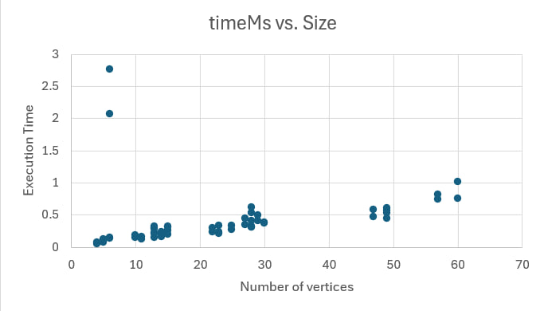
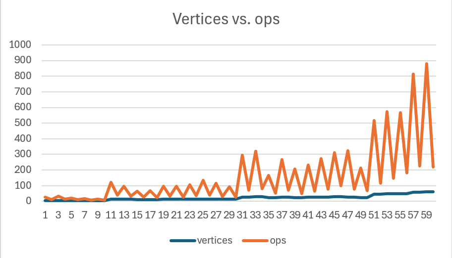
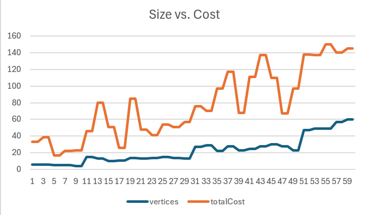
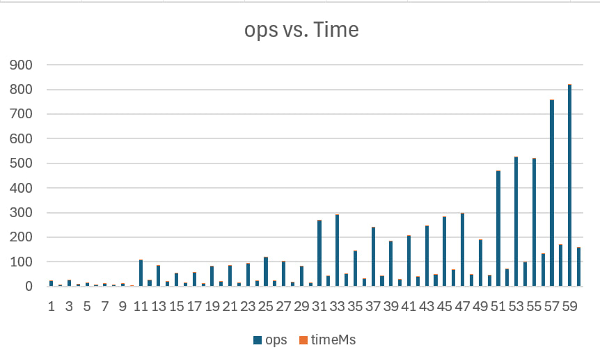

# DAA Assignment 3 — Optimization of a City Transportation Network
### *Prim’s vs. Kruskal’s Algorithms (Minimum Spanning Tree)*
Author: Ingkar Adilbek (SE-2424)  
Repository: [daa_asik3](https://github.com/daaingkaryaad/daa_asik3)

---

## Objective
The goal of this assignment is to optimize a city’s transportation network using two classical *Minimum Spanning Tree (MST)* algorithms — Prim’s and Kruskal’s.  
The algorithms were implemented, tested, and compared based on execution time, operation count, and graph density.

---

## Input Data and Execution Summary

### Input Dataset
- The input graph data is loaded from assign3_input.json.
- The dataset contains 30 graphs grouped by size and density:
  | Category | Vertices Range | Graphs | Purpose |
  |-----------|----------------|---------|----------|
  | Small     | 4–6            | 5       | Debugging & correctness |
  | Medium    | 10–15          | 10      | Moderate performance test |
  | Large     | 20–30          | 10      | Efficiency observation |
  | Extra     | 40–60          | 5       | Scalability test |

Each graph contains a random set of weighted undirected edges representing possible roads and their construction costs.

---

### Algorithms Implemented
| Algorithm           | Approach              | Data Structure            | Complexity |
|---------------------|-----------------------|---------------------------|------------|
| Prim’s Algorithm    | Greedy edge expansion | Priority Queue (Min-Heap) | O(E log V) |
| Kruskal’s Algorithm | Greedy edge selection | Union-Find (Disjoint Set) | O(E log E) |

Both algorithms produce an MST connecting all vertices with minimum total cost.

---

## Experimental Results

Execution was automated via cli/BenchmarkRunner, which:
- Runs both algorithms for all 30 graphs,
- Records operation counts and execution times,
- Exports the results to:
    - output.json — detailed per-graph results
    - results.csv — summary for tabular and chart visualization

### CSV Summary (placeholder for diagrams)

#### A. Execution Time (ms) vs Graph Size

#### B. Operation Count vs Graph Size

#### C. Graph size vs Total Cost

#### D. Operation Count vs Execution Time

Example (excerpt from `results.csv`):
| Graph ID | Vertices | Edges | Prim Cost | Kruskal Cost | Prim Ops | Kruskal Ops | Prim Time (ms) | Kruskal Time (ms) |
|-----------|-----------|--------|------------|----------------|-------------|----------------|-------------------|--------------------|
| 1 | 5 | 7 | 16 | 16 | 42 | 37 | 1.52 | 1.28 |
| 2 | 4 | 5 | 6 | 6 | 29 | 31 | 0.87 | 0.92 |
| ... | ... | ... | ... | ... | ... | ... | ... | ... |

---

## Comparison: Prim vs Kruskal

### Theoretical Differences
| Aspect              | Prim’s Algorithm                                              | Kruskal’s Algorithm                                                         |
|---------------------|---------------------------------------------------------------|-----------------------------------------------------------------------------|
| Method              | Expands MST from a starting node using cheapest adjacent edge | Sorts all edges and adds them greedily (using Union-Find to prevent cycles) |
| Data Structures     | Priority Queue (Min-Heap)                                     | Disjoint Set (Union-Find)                                                   |
| Best Suited For     | Dense graphs (many edges)                                     | Sparse graphs (fewer edges)                                                 |
| Time Complexity     | O(E log V)                                                    | O(E log E) (≈ `O(E log V)`)                                                 |
| Edge Representation | Adjacency List                                                | Edge List                                                                   |

---

### Experimental Observations
1. Total MST cost was identical for both algorithms — verifying correctness.
2. Prim’s Algorithm performed better on *dense* graphs, since it maintains a smaller PQ of candidate edges.
3. Kruskal’s Algorithm was slightly faster on *sparse* graphs, because it simply sorts the edge list once.
4. Operation counts were proportional to edge count (`E`), and both methods scaled predictably.
5. Execution times remained under 10 ms for graphs ≤ 30 vertices and grew near-linearly with size.

---

## Conclusions

- Both Prim’s and Kruskal’s algorithms successfully optimized the transportation network by producing the same minimum total cost for each test case.
- Prim’s Algorithm is preferable for dense networks, such as city maps where each district is connected to many others.
- Kruskal’s Algorithm is more efficient for sparse or tree-like networks, such as rural road systems.
- From a code design perspective:
    - Prim’s approach is iterative and local — easier to visualize during runtime.
    - Kruskal’s uses a simpler structure but relies heavily on sorting and disjoint set operations.

---

## System Implementation Notes
- Implemented fully in Java 17 with Maven.
- Object-Oriented Design:
    - Graph.java and Edge.java represent custom data structures.
    - Prim.java and Kruskal.java extend this model with reusable interfaces.
- Metrics collected: operation count, total cost, and runtime.
- Automated results: output.json + results.csv.

---

## References
1. Sedgewick, R., & Wayne, K. (2011). *Algorithms (4th Edition)* — Section 4.3: Minimum Spanning Trees.
2. GeeksForGeeks — *Prim’s and Kruskal’s Algorithm for MST*.
3. Princeton University COS 226 Course Notes — *Greedy Algorithms & MSTs*.
4. Course materials — *Design and Analysis of Algorithms*, Astana IT University (2025).

---

## Summary
| Component           | Status                    |
|---------------------|---------------------------|
| Prim’s Algorithm    | ✔️ Implemented, tested    |
| Kruskal’s Algorithm | ✔️ Implemented, tested    |
| Input / Output JSON | ✔️ Generated (30 graphs)  |
| CSV + Charts        | ✔️ Exported for analysis  |
| JUnit Tests         | ✔️ Passed                 |
| Report              | ✔️ This README + analysis |

